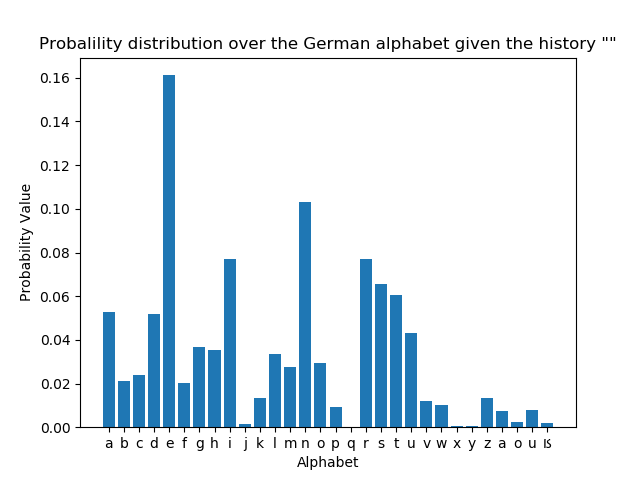
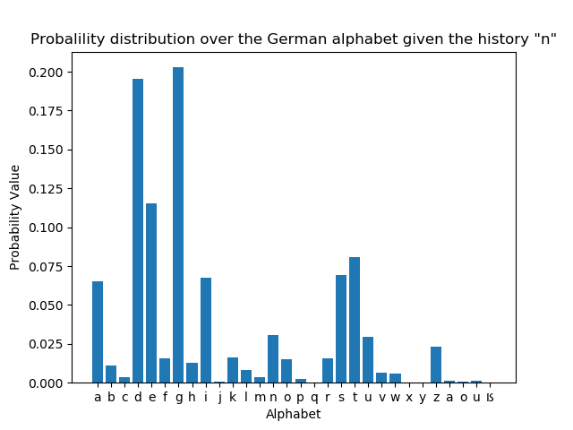
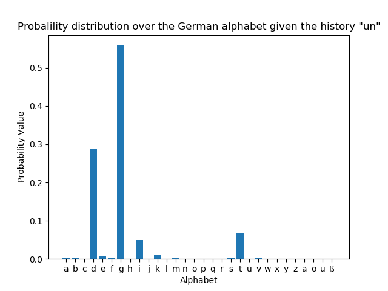
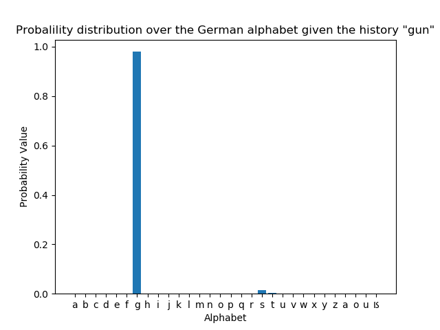
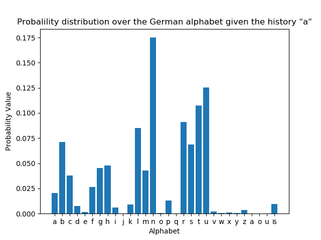
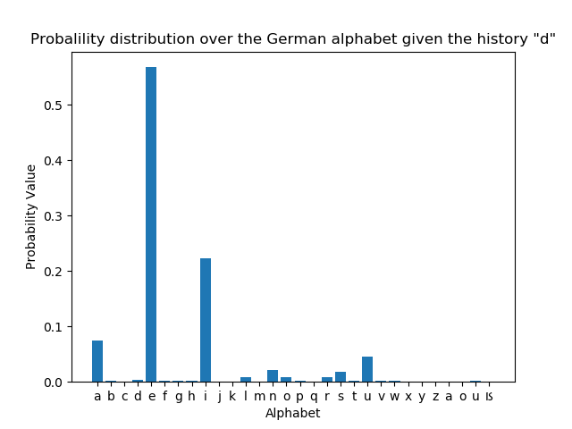
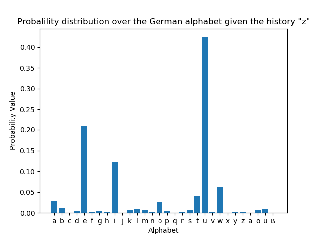
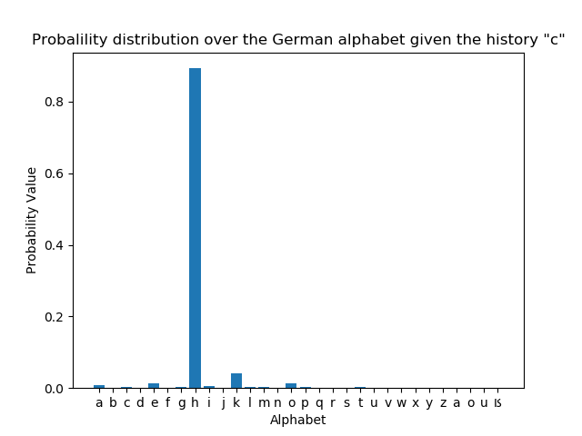
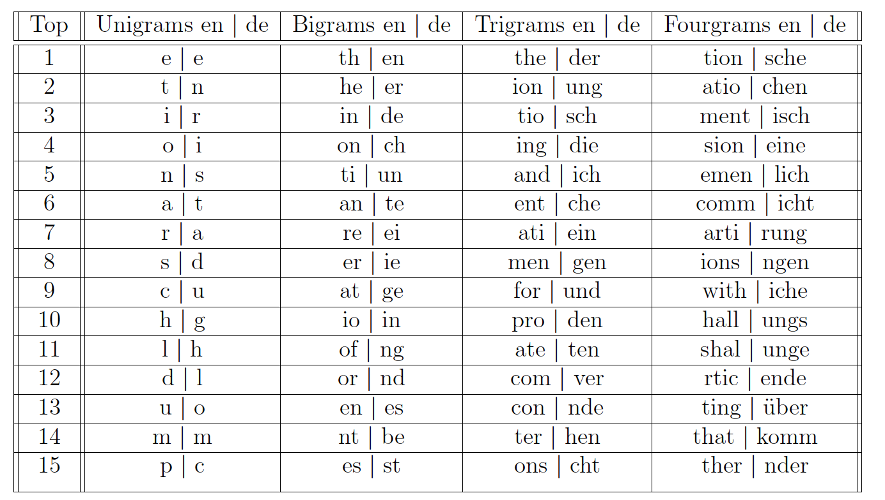

# Character N-grams and Entropy

This repo contains code to:
1) convert each text corpus into a linear sequence of character n-grams
(up to n = 4: unigrams, bigrams, trigrams and fourgrams);
2) calculate probability distribution over the symbols of the
alphabet given a particular history; 
3) compute the entropy of the probability distributions. 

Character n-gram distributions are investigated in two languages: English and German.

To run the code 

`python character_ngrams_probdist_&_entropy.py`

The program will produce the following plots
 

Probability Distribution of Characters in the German Language by Growing History

Bigram Probability Distribution of Characters in the German Language Given the History 'a', 'd', 'z' and 'c'.

 

Entropy for N-gram Distributions of Different N-gram Size

| History | No History | History = n | History = un | History = gun |
|---------|------------|-------------|--------------|---------------|
| Entropy | 4.182173   | 3.588221    | 1.766463     | 0.170460      |

Entropy for Bigram Probability Distributions

| History | History = a   | History = d   | History =  z  | History =  c  |
|---------|---------------|---------------|---------------|---------------|
| Entropy | 3.757168      | 2.056076      | 2.745905      | 0.826241      |

15 the most frequent character unigrams, bigrams, trigrams, and fourgrams in the English and German corpora

